# Heterogeneous Agents and Endogenous Bubbles

### An implementation and extension of the Brock & Hommes (1998) adaptive belief system

**Kamal El Halfaoui**

---

## Contents

**Part I — The study**

1. [Introduction and research framework](#1--introduction-and-research-framework)
2. [Research design: why these market compositions?](#2--research-design-why-these-market-compositions)
3. [Data and methodology](#3--data-and-methodology) · [3.1 Data](#31-data) · [3.2 Overview of the framework](#32-overview-of-the-framework)
4. [Empirical results](#4--empirical-results)
5. [Discussion](#5--discussion)
6. [Conclusion](#6--conclusion)
7. [Limitations and future research](#7--limitations-and-future-research)

**Part II — The code**

8. [Repository layout and reproduction](#8--repository-layout-and-reproduction)
9. [References](#9--references)

---

# Part I — The study

## 1 · Introduction and research framework

Six kinds of trader disagree about where an asset price is heading. Each period
they observe which forecasting rule made money, and some of them switch to it.
Nobody is irrational, no external shock hits the market, and the risk-free rate
never moves — yet the price cycles, bubbles and crashes.

That is the claim of the adaptive belief system of Brock & Hommes (1998), and
this study asks how far it holds. The model is attractive because it locates the
source of financial instability inside the market rather than outside it: price
movement is generated by the *composition* of beliefs shifting in response to
past profit, not by news arriving. If that mechanism works, it offers an account
of bubbles that does not require anyone to behave stupidly.

### Research questions

| | Question | Addressed in |
|---|---|---|
| **RQ1** | What kinds of dynamics does the model actually produce — fixed points, cycles, quasi-periodicity, chaos? | §4.1 |
| **RQ2** | Which parameter is responsible for instability: the speed at which traders switch rules, or the strength with which one rule amplifies price moves? | §4.2–4.3 |
| **RQ3** | Does the model reproduce the stylised facts of real asset returns — fat tails, unpredictable signs, clustered volatility? | §4.4 |
| **RQ4** | Which forecasting rules survive evolutionary selection, and does survival track being *correct* or being *profitable*? | §4.5–4.6 |
| **RQ5** | Do the stabilising forces usually credited in this literature — a fundamentalist anchor, a higher risk-free rate — actually stabilise? | §4.7 |

### Framework

The economy contains one risk-free asset paying gross return $`R = 1+r`$ and one
risky asset in zero net supply. Traders are myopic mean-variance maximisers who
differ only in how they forecast the deviation of the price from its fundamental
value. Each period the population reallocates itself across forecasting rules
according to realised profit. The whole system reduces to one scalar difference
equation, derived in §3.2.

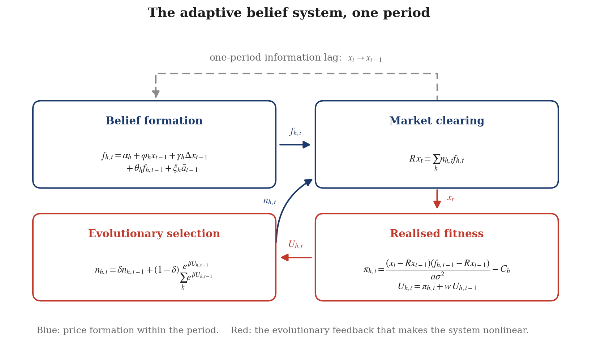

> **Figure 1.** The adaptive belief system, one period. Blue: price formation
> within the period. Red: the evolutionary feedback from realised profit back
> into population shares, which is what makes the system nonlinear. The dashed
> path is the one-period information lag — traders act on a forecast, the price
> then moves, and only afterwards do they learn whether the forecast paid.

---

## 2 · Research design: why these market compositions?

> *Note on structure: the original contents list asks "why these countries?".
> This study has no cross-country dimension, so the equivalent design question —
> why this particular set of trader types, market compositions and parameter
> regimes — is answered here under the same heading and numbering.*

Three design choices determine what the study can and cannot show.

### 2.1 Why these six forecasting rules

The rule set spans the space of *linear* predictors of the deviation while
keeping each type economically interpretable. Every type is a parameter
restriction of one general rule (equation 7 below), which makes the comparison
across types clean: they differ only in which loadings are switched on, not in
functional form.

| Type | Economic role | Why included |
|---|---|---|
| Fundamentalists | stabilising anchor | the only rule that pulls the price back; the natural candidate for "what keeps markets efficient" |
| Trend followers | destabilising amplifier | the standard chartist; the mechanism most often blamed for bubbles |
| Adapters | unbiased benchmark | the only rule *correct on average* in the long run — the calibration benchmark |
| Learners | anchor-and-adjust | a behavioural rule with documented experimental support |
| Optimists / Pessimists | pure sentiment | forecast a constant and ignore all data — the null of "no information processing at all" |

Adapters matter disproportionately. Because their restriction
$`\varphi + \theta = 1`$ makes the rule an exponentially weighted moving average,
they are the best-calibrated forecaster in the market. Including them is what
allows §4.6 to separate *being right* from *being profitable*.

### 2.2 Why five types versus six

The five-type market is the six-type market with fundamentalists deleted. This
is the cleanest available counterfactual for the claim that a fundamentalist
presence stabilises prices: everything else is held fixed, so any difference in
volatility is attributable to that one deletion. The comparison is run at two
intensities of choice so the result cannot be an artefact of one calibration.

### 2.3 Why these parameter regimes

Rather than fix one calibration, the study defines four named regimes and works
across them, because a single point in parameter space cannot distinguish "the
model behaves like this" from "the model behaves like this *here*".

| Calibration | $`\beta`$ | $`\varphi`$ | $`\alpha_{opt}`$ | $`\delta`$ | $`w`$ | Noise | Purpose |
|---|---|---|---|---|---|---|---|
| `benchmark` | 2 | 0.2 | 1.5 | 0 | 0 | 0 | low switching speed; stable cycle |
| `quasiperiodic` | 20 | 0.2 | 1.5 | 0 | 0 | 0 | fast switching; motion on a torus |
| `chaotic` | 10 | 1.0 | 0.3 | 0 | 0 | 0 | positive Lyapunov exponent |
| `clustering` | 10 | 1.05 | 0.3 | 0.9 | 0.99 | 0.1 | memory in selection; stylised facts |

Beyond these four points, §4.2, §4.3 and §4.7 sweep single parameters
continuously, and §4.3 maps the two-dimensional $`(\beta, \varphi)`$ plane over
676 parameter combinations.

---

## 3 · Data and methodology

### 3.1 Data

**This study uses no external data.** The object of analysis is the model's own
output: the deviation series $`x_t`$, the population shares $`n_{h,t}`$, the
forecasts $`f_{h,t}`$ and the realised profits $`\pi_{h,t}`$, all generated by
simulation. This is standard for agent-based work and has one methodological
consequence worth stating plainly: the study can establish what the model
*implies*, and can compare those implications against documented empirical
regularities, but it cannot estimate the model against a particular market.

| Quantity | Simulated sample | Empirical benchmark used |
|---|---|---|
| Deviation $`x_t`$ | 10,000–60,000 periods, first 2,000–6,000 discarded as burn-in | — |
| Log returns $`r_t`$ | 55,000 periods | fat tails, near-zero return autocorrelation, positive and slowly-decaying $`| r|`$ autocorrelation (Cont, 2001) |
| Tail index | top 1–15% of $`| r_t|`$ | "cubic law", $`\hat\zeta \approx 3`$ |
| Lyapunov exponent | 6,000-period runs | Hénon map $`\lambda_{\max} = 0.419`$; logistic map $`\lambda_{\max} = \ln 2`$ |

All stochastic runs are seeded, so every figure and table in this repository is
exactly reproducible.

---

### 3.2 Overview of the framework

#### 3.2.1 Wealth and demand

Wealth of a trader of type $`h`$ evolves as

**(1)**

```math
W_{h,t+1} = R W_{h,t} + ( p_{t+1} + y_{t+1} - R p_t ) z_{h,t}
```

where $`p_t`$ is the price, $`y_t`$ the dividend, and $`z_{h,t}`$ the holding of the
risky asset. Traders maximise myopic mean-variance utility with risk aversion
$`a`$,

**(2)**

```math
\max_{z} \mathbb{E}_{h,t}[W_{h,t+1}] - \frac{a}{2} \mathbb{V}_{h,t}[W_{h,t+1}]
```

which, under a common constant conditional variance $`\sigma^2`$ of excess
returns, gives demand

**(3)**

```math
z_{h,t} = \frac{\mathbb{E}_{h,t}[p_{t+1} + y_{t+1} - R p_t]}{a \sigma^{2}}
```

#### 3.2.2 Market clearing and the fundamental price

Clearing at zero outside supply, $`\sum_h n_{h,t} z_{h,t} = 0`$, gives

**(4)**

```math
R p_t = \sum_{h} n_{h,t} \mathbb{E}_{h,t}[p_{t+1} + y_{t+1}]
```

Under homogeneous rational expectations with an IID dividend, the bounded
solution is the constant **fundamental price**

**(5)**

```math
p^{*} = \frac{\bar{y}}{R - 1}
```

Defining the **deviation from fundamental value** $`x_t \equiv p_t - p^{*}`$, and
assuming every type knows the fundamental and disagrees only about the
deviation — so $`\mathbb{E}_{h,t}[p_{t+1}+y_{t+1}] = p^{*} + f_{h,t}`$ — the whole
economy collapses to one scalar equation:

**(6)**

```math
R x_t = \sum_{h=1}^{H} n_{h,t} f_{h,t}
```

#### 3.2.3 Belief formation

Every type is a parameter restriction of one linear predictor:

**(7)**

```math
f_{h,t} = \alpha_h + \varphi_h x_{t-1} + \gamma_h (x_{t-1} - x_{t-2}) + \theta_h f_{h,t-1} + \xi_h \frac{\bar{x}_{t-1} + x_{t-1}}{2}
```

where $`\bar{x}_{t-1} = \frac{1}{t}\sum_{s=0}^{t-1} x_s`$ is the running sample
mean. Every term is dated $`t-1`$ or earlier, so the forecast is strictly causal.

The six types are:

| Eq. | Type | Rule | Restriction |
|---|---|---|---|
| **(8)** | Fundamentalists | $`f_{h,t} = 0`$ | all loadings zero |
| **(9)** | Trend followers | $`f_{h,t} = \alpha_h + \varphi_h x_{t-1}`$ | $`\alpha_h, \varphi_h \neq 0`$ |
| **(10)** | Adapters | $`f_{h,t} = \varphi_h x_{t-1} + \theta_h f_{h,t-1}`$ | $`\varphi_h + \theta_h = 1`$ |
| **(11)** | Learners | $`f_{h,t} = \gamma_h (x_{t-1} - x_{t-2}) + \xi_h \frac{\bar{x}_{t-1} + x_{t-1}}{2}`$ | $`\gamma_h, \xi_h \neq 0`$ |
| **(12)** | Optimists | $`f_{h,t} = \alpha_h`$ | $`\alpha_h > 0`$ |
| **(13)** | Pessimists | $`f_{h,t} = \alpha_h`$ | $`\alpha_h < 0`$ |
#### 3.2.4 Fitness and evolutionary selection

Realised profit is the excess return on the position taken one period earlier:

**(14)**

```math
\pi_{h,t} = (x_t - R x_{t-1}) \frac{f_{h,t-1} - R x_{t-1}}{a \sigma^{2}} - C_h
```

Fitness accumulates profit geometrically, so that $`1/(1-w)`$ is roughly the
number of periods a rule is judged on:

**(15)**

```math
U_{h,t} = \pi_{h,t} + w U_{h,t-1},   w \in [0,1)
```

Shares follow a discrete-choice rule with inertia $`\delta`$:

**(16)**

```math
n_{h,t} = \delta n_{h,t-1} + (1-\delta) \frac{\exp(\beta U_{h,t-1})}{\sum_{k=1}^{H} \exp(\beta U_{k,t-1})}
```

The **intensity of choice** $`\beta \geq 0`$ governs how sharply traders move
toward the rule that has been performing best. At $`\beta = 0`$ shares stay
uniform; as $`\beta \to \infty`$ all mass concentrates on last period's winner.

**Parameter summary**

| Symbol | Meaning | Baseline |
|---|---|---|
| $`R`$ | gross risk-free return | 1.05 |
| $`\beta`$ | intensity of choice | 2 |
| $`\delta`$ | inertia in shares | 0 |
| $`w`$ | memory in fitness | 0 |
| $`a`$ | risk aversion | 1 |
| $`\sigma`$ | conditional volatility | 1 |
| $`\bar y`$ | mean dividend | 1 |
| $`C_1`$ | fundamentalist information cost | 0.05 |

#### 3.2.5 Timing

Within period $`t`$, in order:

1. **Forecasts** — each type evaluates (7) from $`x_{t-1}, x_{t-2}, f_{h,t-1}, \bar x_{t-1}`$
2. **Selection** — shares set by (16) from fitness $`U_{h,t-1}`$
3. **Clearing** — price set by (6): $`x_t = \frac{1}{R}\sum_h n_{h,t} f_{h,t}`$
4. **Settlement** — profit (14) realised on the position taken at $`t-1`$
5. **Fitness update** — equation (15)

The one-period lag between steps 3 and 4 is not a convenience. It is the source
of the dynamics: remove it and the feedback loop generating cycles and chaos
disappears.

#### 3.2.6 Steady state and local stability

Setting $`\delta = w = 0`$, a steady state $`\bar x`$ of the deterministic skeleton
satisfies

**(17)**

```math
R \bar{x} = \sum_h \bar{n}_h [ \alpha_h + \varphi_h \bar{x} + \theta_h \bar{f}_h + \xi_h \bar{x} ]
```

With no biases ($`\alpha_h = 0\ \forall h`$) the fundamental steady state
$`\bar x = 0`$ always exists, and shares there are uniform because every type earns
identical zero profit. A unit shock to $`x_{t-1}`$ moves the aggregate forecast by
the share-weighted extrapolation coefficient and the price by $`1/R`$ times it, so
the fundamental steady state is locally stable when

**(18)**

```math
\frac{1}{R}\sum_h \bar{n}_h \varphi_h < 1
```

Because $`\bar n_h`$ itself depends on $`\beta`$, the stability boundary is a *curve*
in the $`(\beta,\varphi)`$ plane, not a vertical line — which is exactly what §4.3
maps.

#### 3.2.7 Numerical methodology

Three implementation decisions are load-bearing.

**(a) Overflow-safe discrete choice.** Equation (16) is never evaluated as
written. For $`\beta U \gtrsim 700`$ the exponential overflows to `inf` and shares
become `nan`; in double precision this occurs around $`\beta \approx 5`$. The code
uses the algebraically identical max-shifted form

**(19)**

```math
\frac{\exp(\beta U_h)}{\sum_k \exp(\beta U_k)} = \frac{\exp(\beta U_h - m)}{\sum_k \exp(\beta U_k - m)},   m = \max_k \beta U_k
```

Every exponent is now bounded above by zero. Without this, §4.2 — which runs to
$`\beta = 40`$ — could not be computed at all.

**(b) Divergence is caught, not ignored.** When $`\varphi > R`$ and the
fundamentalist share collapses, $`x_t`$ grows without bound. This is a genuine
property of the model, but left alone it overflows and fills every downstream
statistic with `nan`. The kernel truncates the run, records `diverged_at`, and
holds arrays at their last finite value. Divergent runs are excluded from
bifurcation diagrams and hatched on the regime map.

**(c) Returns are taken on the price, not the deviation.** $`x_t`$ crosses zero
constantly, so $`(x_t - x_{t-1})/x_{t-1}`$ is numerically meaningless. All return
statistics use the price level $`p_t = p^{*} + x_t`$:

**(20)**

```math
r_t = \ln p_t - \ln p_{t-1}
```

#### 3.2.8 Diagnostics

**Largest Lyapunov exponent** (Rosenstein et al., 1993). The series is embedded
in $`m`$ dimensions with delay $`\tau`$; for each embedded point the nearest
neighbour at least `min_sep` periods away in time is located (the Theiler
window); the mean log separation of those pairs is tracked forward; and
$`\lambda_{\max}`$ is the slope of the initial linear stretch:

**(21)**

```math
\frac{1}{N}\sum_{i} \ln d_i(k) \approx \lambda_{\max} k + c
```

**Hill tail index** (Hill, 1975), over the top $`k`$ order statistics of
$`| r_t |`$:

**(22)**

```math
\hat{\zeta}^{-1} = \frac{1}{k}\sum_{i=1}^{k} \ln \frac{|r|_{(i)}}{|r|_{(k)}}
```

**Sample autocorrelation** at lag $`k`$, with Bartlett bands $`\pm 1.96/\sqrt{T}`$:

**(23)**

```math
\hat\rho_k = \frac{\sum_{t=1}^{T-k}(z_t - \bar z)(z_{t+k} - \bar z)}{\sum_{t=1}^{T}(z_t - \bar z)^2}
```

**Validation.** The Lyapunov estimator is checked against systems with published
exponents rather than trusted:

| System | True $`\lambda_{\max}`$ | Estimated |
|---|---|---|
| Hénon map ($`a=1.4`$, $`b=0.3`$) | 0.419 | **0.411** |
| Logistic map, $`r=4`$ | $`\ln 2 \approx 0.693`$ | 0.585 |
| Logistic map, $`r=3.5`$ (period 4) | $`<0`$ | $`\approx 0`$ |

Period detection recovers the logistic cascade $`1\to2\to4\to8\to`$ aperiodic
exactly; the Hill estimator recovers a known Pareto index. The estimator
resolves exponents of order 0.05 comfortably, so **anything within $`\pm0.01`$ of
zero is reported as indistinguishable from zero** — which is why every Lyapunov
panel carries an explicit tolerance band.

---

## 4 · Empirical results

### 4.1 The same model produces cycles, tori and chaos

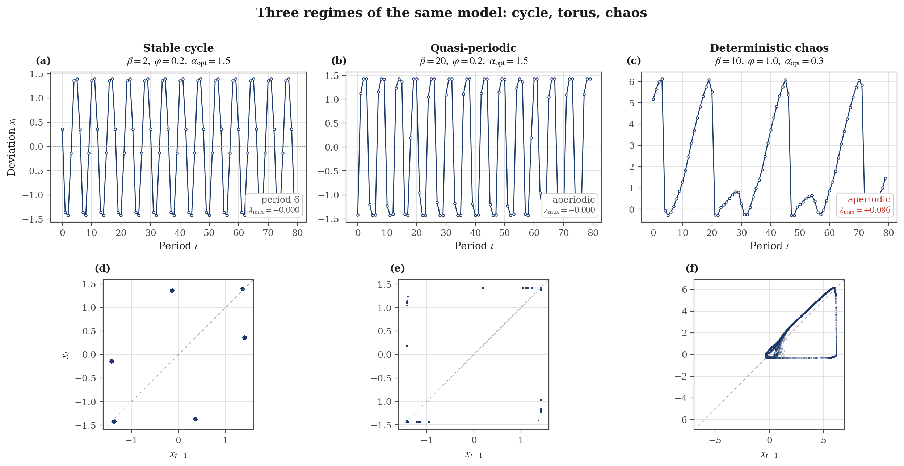

> **Figure 2.** Three dynamic regimes of the deterministic skeleton. Top row:
> deviation over time. Bottom row: phase portrait in $`(x_{t-1}, x_t)`$. A stable
> cycle traces a finite set of points, a torus traces closed arcs, a chaotic
> attractor traces a fractal set.

| Regime | Parameters | Period | $`\lambda_{\max}`$ | $`\sigma_x`$ | Range |
|---|---|---|---|---|---|
| Stable cycle | $`\beta=2,\ \varphi=0.2`$ | 6 | $`-0.0003`$ | 1.142 | 2.818 |
| Quasi-periodic | $`\beta=20,\ \varphi=0.2`$ | aperiodic | $`-0.0000`$ | 1.329 | 2.857 |
| Deterministic chaos | $`\beta=10,\ \varphi=1.0`$ | aperiodic | **+0.0864** | 2.227 | 6.454 |

No random shock appears anywhere in these three runs. All irregularity in the
right-hand column is generated by traders switching between rules. **RQ1 is
answered affirmatively: the model spans fixed points, cycles, quasi-periodicity
and genuine chaos.**

---

### 4.2 Faster learning destabilises prices — but does not by itself cause chaos

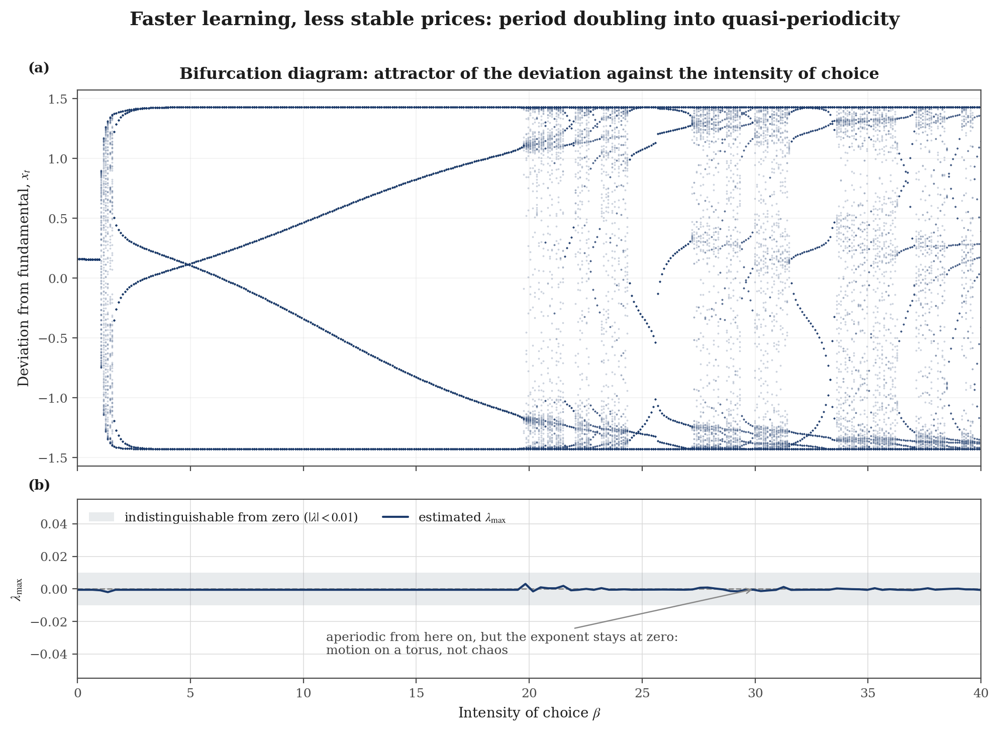

> **Figure 3.** Bifurcation diagram in the intensity of choice, with the
> Lyapunov spectrum beneath. Raising $`\beta`$ takes the market from a fixed point
> through period doubling into aperiodic motion around $`\beta \approx 19.5`$.

The bifurcation structure is unambiguous. The Lyapunov result is the surprise:
across the entire grid $`\beta \in [0, 40]`$ the largest exponent never exceeds
**0.0031**, and **0% of grid points** register above the 0.01 resolution
threshold. Since the same estimator recovers 0.411 against a true 0.419 on the
Hénon map, this is zero.

**The aperiodic motion beyond $`\beta \approx 19.5`$ is a torus, not chaos.** This
distinction is invisible in the bifurcation diagram alone, which is why the
Lyapunov panel is there.

---

### 4.3 Chaos comes from extrapolation, not from switching speed

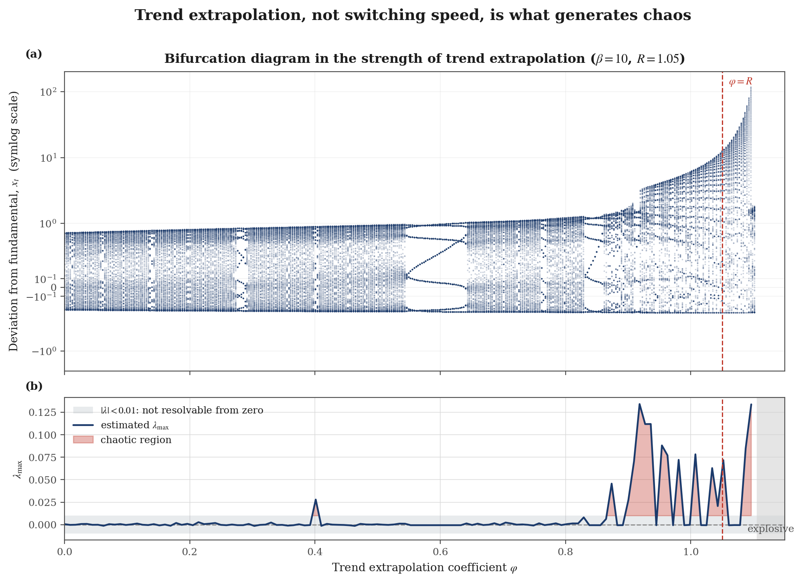

> **Figure 4.** Bifurcation diagram in the trend extrapolation coefficient at
> fixed $`\beta = 10`$, on a symmetric log scale because the attractor grows by
> two orders of magnitude across the sweep. The red line marks $`\varphi = R`$.

Varying $`\varphi`$ instead of $`\beta`$ produces what $`\beta`$ did not:

- **chaotic** across $`\varphi \in [0.401,\ 1.097]`$
- **peak $`\lambda_{\max} = +0.1341`$**
- **explosive** for 5% of the grid, beyond $`\varphi \approx 1.1`$

The complex region begins *before* $`\varphi = R`$, consistent with the stability
condition (18): the destabilising rule does not need $`\varphi > R`$ on its own,
only enough share that the weighted average crosses the threshold.

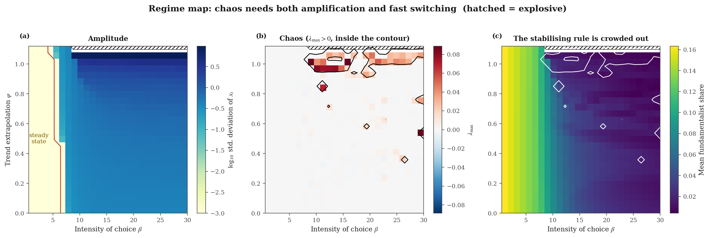

> **Figure 5.** Regime map over 676 combinations of $`(\beta, \varphi)`$. Panel
> (a): amplitude, floored at $`10^{-3}`$ to keep the steady-state region from
> flattening the scale. Panel (b): largest Lyapunov exponent, chaotic region
> inside the black contour. Panel (c): mean fundamentalist share. Hatching marks
> explosive combinations.

| Outcome | Share of grid |
|---|---|
| Chaotic ($`\lambda_{\max} > 0.01`$) | 41 / 657 non-divergent cells (**6.2%**) |
| Explosive | 19 / 676 cells (**2.8%**) |

**Chaos requires both ingredients.** It is a band, not a corner: amplification
strong enough for the price to feed back on itself, *and* an intensity of choice
high enough for the population to actually reallocate toward whichever rule is
winning. Weaken either and the market settles into a cycle.

Panel (c) carries the uncomfortable finding: **the fundamentalist share is
lowest exactly where dynamics are wildest**, because during a bubble the
stabilising forecast is the one losing money fastest. The rule that would calm
the market is selected out of it precisely when it is most needed.
**RQ2 is answered: extrapolation strength, not switching speed, is the source of
chaos — though switching speed is a necessary co-factor.**

---

### 4.4 Volatility clustering requires memory

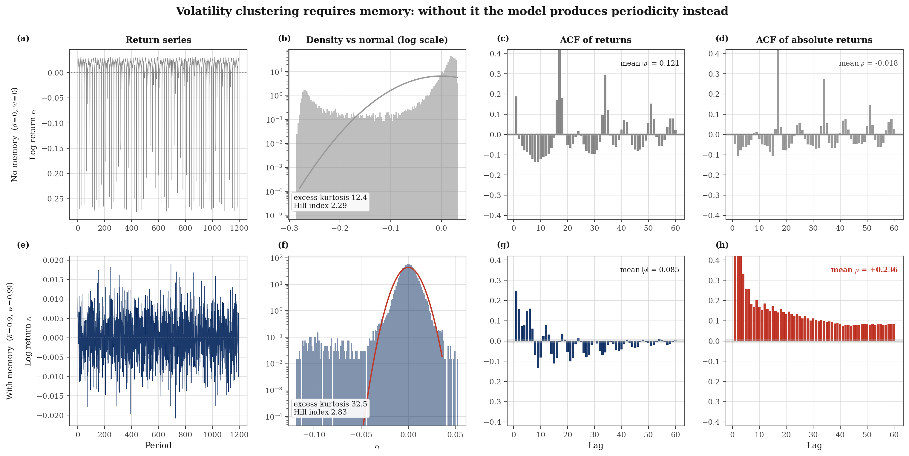

> **Figure 6.** Stylised facts under two calibrations. Top row: no memory
> ($`\delta = w = 0`$). Bottom row: memory in both fitness and shares
> ($`\delta = 0.9`$, $`w = 0.99`$). Columns: return series, density against a fitted
> normal on a log scale, ACF of returns, ACF of absolute returns.

| Statistic | No memory | With memory | Empirical benchmark |
|---|---|---|---|
| Excess kurtosis | 12.40 | **32.51** | large positive |
| Skewness | $`-3.64`$ | $`-3.05`$ | mildly negative |
| Jarque–Bera $`p`$ | 0.000 | 0.000 | rejects normality |
| Hill index (5% tail) | 2.29 | **2.83** | $`\approx 3`$ (cubic law) |
| Mean $`|\hat\rho|`$ of $`r_t`$, lags 1–20 | 0.121 | **0.086** | $`\approx 0`$ |
| Mean $`\hat\rho`$ of $`| r_t|`$, lags 1–20 | **-0.018** | **+0.236** | positive, slow decay |

With no memory the model produces bubbles at near-regular intervals, so the ACF
of absolute returns spikes at the dominant period (lags 17, 34, 51) and averages
to zero. **That is periodicity, not clustering** — the opposite of what data
show.

Adding memory makes the switching *intermittent*: the market stays quiet for
long stretches and then erupts. Panel (h) shows the textbook slowly-decaying
profile.

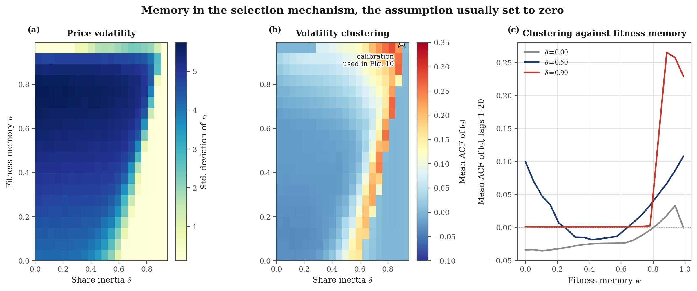

> **Figure 7.** The $`(\delta, w)`$ plane. Panel (a): price volatility. Panel (b):
> clustering. Panel (c): slices at three values of $`\delta`$. The star marks the
> calibration used in Figure 6.

Strongest clustering occurs at $`\delta = 0.85`$, $`w = 0.99`$, reaching
$`\hat\rho = 0.283`$. The effect occupies a narrow ridge at high $`\delta`$, and the
two surfaces have different shapes: **memory calms the price level while making
turbulence more persistent.**

**RQ3 is answered conditionally: the model reproduces fat tails under any
calibration, but reproduces volatility clustering only when the selection
mechanism has memory.**

---

### 4.5 Population dynamics and the shape of the attractor

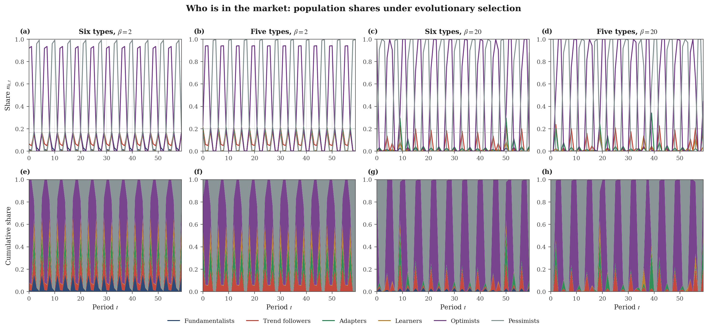

> **Figure 8.** Population shares over time, as lines (top) and stacked areas
> (bottom), across four configurations. The dotted line marks an even split.

Under the baseline the shares are extremely volatile because $`\delta = w = 0`$:
the entire population re-sorts every period on one period of profit. Optimists
and pessimists alternate dominance, and at $`\beta = 20`$ the switching is
effectively winner-take-all.

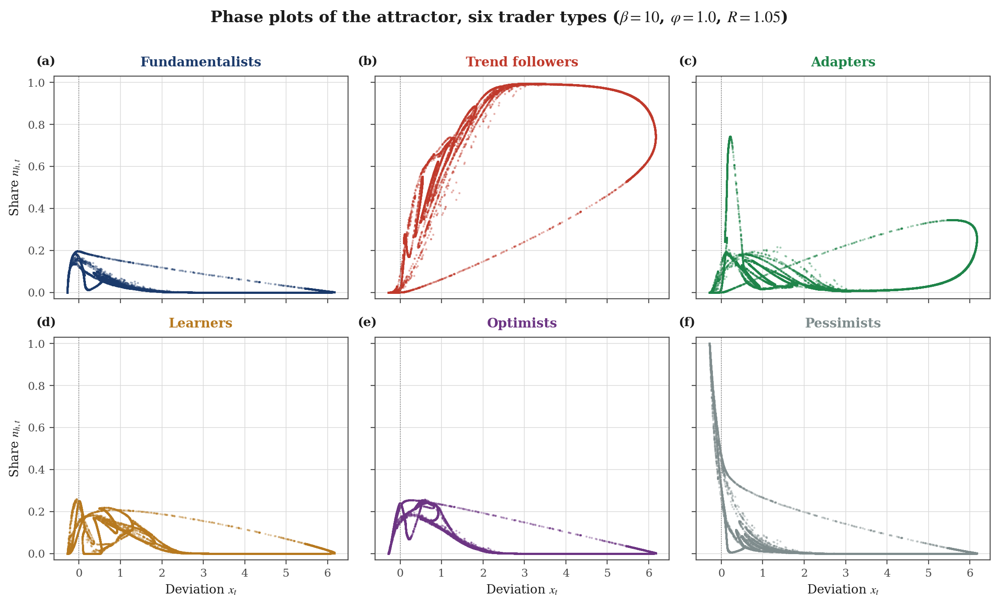

> **Figure 9.** Phase plots of the attractor, six trader types, at the chaotic
> calibration. Each panel projects the attractor onto $`(x_t, n_{h,t})`$.

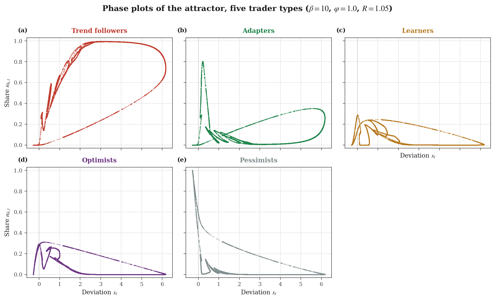

> **Figure 10.** The same projections with fundamentalists removed.

The chaotic calibration is used deliberately: under the benchmark cycle the
attractor is six points, so every panel would collapse to six dots. Structure in
a phase plot requires an attractor with structure.

The panels are readable as strategy profiles. Trend followers reach share
$`\approx 1`$ at large positive deviations — they own the bubble. Pessimists reach
$`\approx 1`$ near zero deviation — they own the crash. Fundamentalists never
exceed 0.2 anywhere.

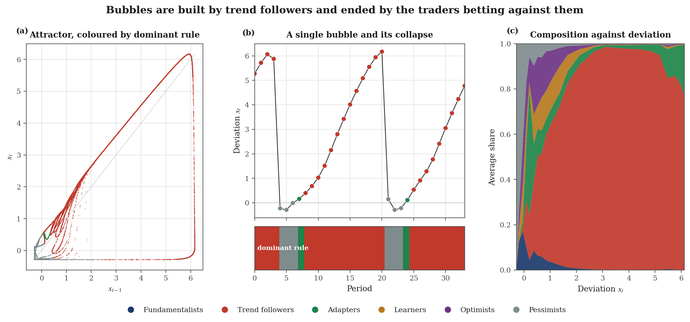

> **Figure 11.** The bubble mechanism. Panel (a): attractor coloured by dominant
> rule. Panel (b): a single bubble episode with the dominant-rule band beneath.
> Panel (c): average market composition conditional on the deviation.

The cycle: near fundamental value no rule dominates; as the deviation grows
trend followers gain share, which pushes the price further, which increases
their share again; the climb ends when the deviation is large enough that
pessimists are positioned for the reversal; their share jumps and the price
collapses in a single period.

**Nothing external triggers the crash.** It arrives because the population that
built the bubble is, at the top of it, positioned worst for what happens next.

---

### 4.6 Selection rewards being extreme, not being right

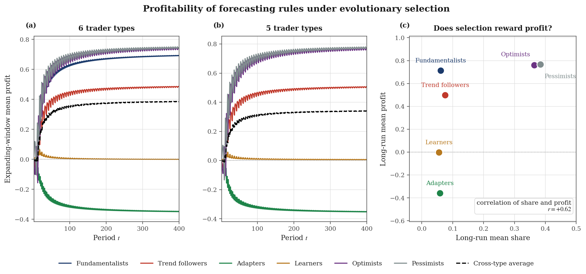

> **Figure 12.** Panels (a)–(b): expanding-window mean profit per rule, six and
> five types. Panel (c): long-run mean profit against long-run mean share.

| Type | Share (6 types) | Profit (6 types) | Share (5 types) | Profit (5 types) |
|---|---|---|---|---|
| Fundamentalists | 0.061 | $`+0.714`$ | — | — |
| Trend followers | 0.076 | $`+0.498`$ | 0.087 | $`+0.520`$ |
| **Adapters** | 0.059 | **-0.359** | 0.071 | **-0.362** |
| Learners | 0.056 | $`-0.002`$ | 0.062 | $`+0.005`$ |
| Optimists | 0.364 | $`+0.761`$ | 0.381 | $`+0.790`$ |
| Pessimists | 0.384 | $`+0.766`$ | 0.399 | $`+0.797`$ |

Share and profit correlate at $`r = +0.62`$, so selection is broadly doing its
job. What it selects *for* is the finding.

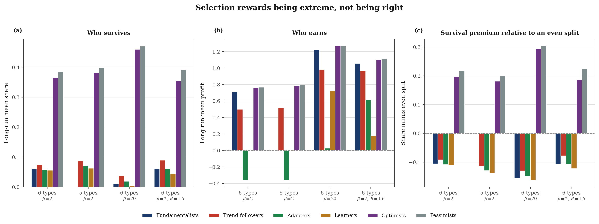

> **Figure 13.** Long-run ecology across four configurations. Panel (a): mean
> share. Panel (b): mean profit. Panel (c): survival premium relative to an even
> split.

Optimists and pessimists — who forecast a constant and ignore all data — take
roughly **75% of the market** between them and earn the highest profits.
Adapters, the only rule unbiased in the long run, **consistently lose money**
across every configuration tested.

**RQ4 is answered: survival tracks profitability, and profitability is not
calibration.**

---

### 4.7 Two stabilising forces that do not stabilise

#### (a) The fundamentalist anchor

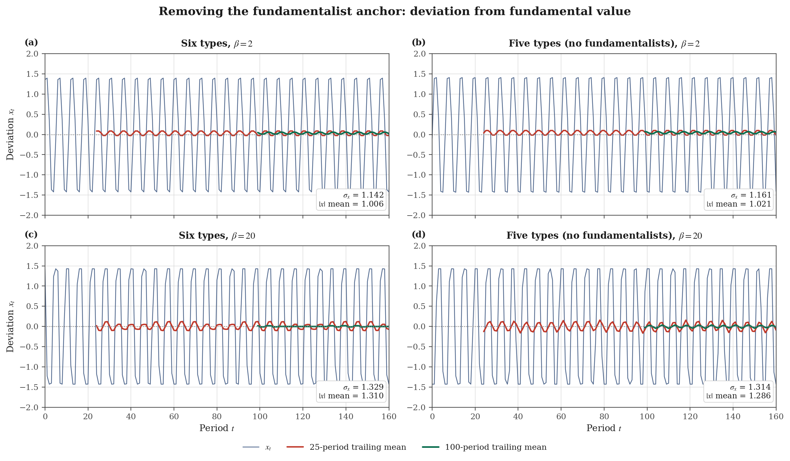

> **Figure 14.** Deviation from fundamental value with 25- and 100-period
> trailing means, six versus five types, at two intensities of choice. Trailing
> means are backward-looking only; a centred average would let future
> information leak into the current value.

| Configuration | $`\sigma_x`$ | Mean $`| x|`$ | Skewness | Excess kurtosis |
|---|---|---|---|---|
| 6 types, $`\beta = 2`$ | 1.142 | 1.006 | $`-0.099`$ | $`-1.544`$ |
| 5 types, $`\beta = 2`$ | 1.161 | 1.021 | $`-0.133`$ | $`-1.544`$ |
| 6 types, $`\beta = 20`$ | 1.329 | 1.310 | $`-0.009`$ | $`-1.939`$ |
| 5 types, $`\beta = 20`$ | **1.314** | 1.286 | $`+0.003`$ | $`-1.909`$ |

Deleting the fundamentalists changes volatility by under 2%, and at $`\beta = 20`$
volatility **falls**. The dynamics are dominated by the optimist and pessimist
biases, which clamp the deviation to $`\pm\alpha/R = \pm 1.43`$ regardless of who
else is present. Fundamentalists never hold more than 6% of the market, and 6%
of a stabilising force does not stabilise much.

#### (b) The risk-free rate

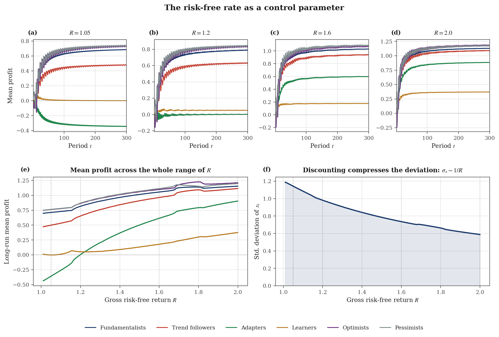

> **Figure 15.** Panels (a)–(d): expanding-window mean profit at four values of
> $`R`$. Panel (e): a continuous sweep of long-run mean profit over
> $`R \in [1.01, 2.0]`$. Panel (f): volatility over the same sweep.

Profits rise with $`R`$ for every rule — adapters cross from loss to profit around
$`R \approx 1.2`$ — but so does everyone's, because $`\sigma_x`$ falls monotonically
from 1.188 at $`R = 1.01`$ to 0.605 at $`R = 1.94`$.

The mechanism is visible directly in equation (6): a larger $`R`$ divides the same
weighted forecast by a larger number. **Rising $`R`$ does not reward any
particular rule; it compresses the arena everyone competes in.**

**RQ5 is answered negatively for both candidate stabilisers.**

---

## 5 · Discussion

### 5.1 Instability is not caused by irrationality

Every trader in this model behaves sensibly: they use a forecasting rule, they
observe which rules made money, and they move toward the ones that did. That is
the minimal definition of adaptive behaviour. The cycles, tori and chaotic
attractors documented in §4.1–4.3 emerge from this alone.

The policy-relevant reading is that **market instability need not have a
culprit**. There is no noise trader here in the sense of someone behaving
badly — the pessimists who end each bubble are the ones positioned *correctly*.

### 5.2 Two different mechanisms, often conflated

The literature routinely attributes chaos in these models to "the intensity of
choice". §4.2 and §4.3 show this is imprecise. $`\beta`$ governs *who* is in the
market; $`\varphi`$ governs how strongly the price feeds back on itself. Raising
$`\beta`$ alone reorganises the population through period doubling into
quasi-periodicity, and the Lyapunov exponent stays at zero throughout.

Distinguishing the two is only possible with a Lyapunov diagnostic, since the
bifurcation diagram shows dense aperiodic bands in both cases. **A bifurcation
diagram alone cannot establish chaos.**

### 5.3 Calibration and profitability are different objectives

The adapter result (§4.6) is the most economically interesting outcome. Their
restriction $`\varphi + \theta = 1`$ makes them an EWMA of past deviations, hence
unbiased in the long run — the best-calibrated forecaster present. They lose
money in every configuration.

The reason is structural. Profit (14) is earned by holding a position that moves
with the price, and the price oscillates between the extreme forecasts. A rule
anchored at either extreme is right half the time and *spectacularly* right when
the market swings its way. A rule that averages past prices is never far wrong
and never usefully right, and it pays the spread every period.

This bears on the survivorship argument for market efficiency: the claim that
irrational traders are competed away requires selection to reward accuracy.
**Here it rewards variance of position, and the two come apart.**

### 5.4 Why memory matters more than it appears

The baseline sets $`\delta = w = 0`$, the assumption that the population re-sorts
completely every period on one period of profit. §4.4 shows this single
assumption is what prevents the model from reproducing volatility clustering.

The economic content is specific and testable: **clustering here is a
consequence of traders being slow to abandon a strategy.** Instant reallocation
destroys it. A market of perfectly responsive agents would not display clustered
volatility, which suggests the empirical regularity is evidence *about
adjustment frictions*, not only about information arrival.

### 5.5 The stabilisers that were not

Neither candidate stabiliser survives testing (§4.7), but for different reasons,
and the difference matters.

The fundamentalist anchor fails because of **share, not sign**. Fundamentalists
do pull in the right direction and are individually profitable — they simply
never hold enough of the market. And §4.3 panel (c) shows the failure is
self-reinforcing: their share is *lowest* where dynamics are wildest.

The risk-free rate fails because of **scale, not direction**. It compresses the
deviation mechanically through (6) without altering the relative attractiveness
of any rule.

---

## 6 · Conclusion

This study implements the Brock & Hommes adaptive belief system, validates the
implementation against systems with known answers, and maps its behaviour across
parameter space. Five findings:

1. **The model spans four dynamic regimes** — fixed points, cycles,
   quasi-periodicity and chaos ($`\lambda_{\max} = +0.086`$) — with no external
   shock of any kind.

2. **Chaos comes from extrapolation, not switching speed.** Across
   $`\beta \in [0,40]`$ the Lyapunov exponent never leaves zero; varying $`\varphi`$
   at fixed $`\beta`$ reaches $`+0.134`$. Chaos occupies 6.2% of the
   $`(\beta,\varphi)`$ grid and requires both ingredients.

3. **Volatility clustering requires memory in the selection mechanism.** With
   $`\delta = w = 0`$ the ACF of absolute returns averages $`-0.018`$; with memory it
   reaches $`+0.236`$ with slow decay. Fat tails appear regardless (excess
   kurtosis 12–33, Hill index 2.3–2.8).

4. **Selection rewards being extreme, not being right.** Sentiment rules take
   75% of the market and the highest profits; the only unbiased forecaster loses
   money in every configuration.

5. **Neither candidate stabiliser stabilises.** Removing fundamentalists changes
   volatility by under 2% and at $`\beta = 20`$ *reduces* it. A higher risk-free
   rate compresses the deviation as $`1/R`$ without favouring any rule.

Findings 3 and 5 in particular are negative results, and they are reported as
such. The model is a strong account of how bubbles can form endogenously, and a
weaker account of the statistical texture of real returns unless its selection
mechanism is given memory.

---

## 7 · Limitations and future research

### 7.1 Limitations

**Constant conditional variance.** Demands (3) use a fixed $`\sigma^2`$ rather
than a conditional variance updated from realised returns. Since the model is
being asked to generate volatility clustering, assuming constant perceived
volatility is a strong restriction, and it plausibly biases §4.4 against the
model.

**Belief parameters are fixed.** Types cannot adjust
$`\alpha, \varphi, \gamma, \theta, \xi`$; only shares evolve. The rule set is
exogenous and closed, so the study establishes which rules win *within this
menu*, not which rules would emerge.

**Dividends are IID.** The fundamental price (5) is constant and all price
movement is deviation. This is analytically convenient but means the model never
faces the identification problem real markets pose — separating endogenous
dynamics from fundamental news.

**Zero net supply, no wealth accumulation.** Selection operates on the *number
of followers*, not on capital. Profitable traders do not become richer and
therefore more influential, which removes a mechanism that would plausibly
strengthen the survivorship argument §5.3 questions.

**Static information costs.** The fundamentalist cost $`C_1`$ is a fixed
per-period charge that does not scale with the informational advantage bought.

**Single-run diagnostics.** Lyapunov exponents and clustering measures are
computed from one seeded run per parameter combination. Confidence bands would
require ensembles, which the 676-cell regime map made computationally awkward.

**No empirical estimation.** As stated in §3.1, the study compares model
implications against documented regularities but does not estimate parameters
against a specific market.

### 7.2 Future research

| Direction | Concrete step |
|---|---|
| **Endogenous risk perception** | Replace $`\sigma^2`$ with a conditional variance updated from realised returns; test whether clustering survives without imposed memory |
| **Stochastic fundamentals** | Let $`y_t`$ follow a persistent process so $`p^*_t`$ moves; measure how much price variance is endogenous versus news-driven |
| **Wealth-weighted selection** | Weight shares by accumulated wealth rather than headcount, and re-run §4.6 — the sharpest test of the survivorship argument |
| **Evolving rules** | Allow belief loadings to mutate, turning the closed menu into an open search over predictors |
| **Empirical calibration** | Estimate $`(\beta, \varphi, \delta, w)`$ by simulated method of moments against an index return series |
| **Ensemble diagnostics** | Replace single-run Lyapunov estimates with ensembles to place confidence bands on the regime map |
| **Policy experiments** | Introduce transaction taxes or position limits and test whether they shrink the chaotic region of Figure 5 |

---

# Part II — The code

## 8 · Repository layout and reproduction

```
src/bh1998/
    agents.py belief rules as restrictions of one linear predictor (eq. 7-13)
    model.py simulation kernel: clearing, profit, selection (eq. 6, 14-16, 19)
    analysis.py moments, bifurcation, Lyapunov, ACF, Hill, sweeps (eq. 21-23)
    plotting.py shared visual style
scripts/
    01..14_*.py one script per figure, each self-contained
    run_all.py regenerate everything
tests/             34 tests, including validation against known systems
docs/model.md full derivation, timing, numerics
figures/           15 generated PNGs
results/           10 generated CSV tables
```

### Reproduction

```bash
pip install -r requirements.txt
python scripts/run_all.py      # ~8 min; scripts 8, 9, 11, 13 are the heavy sweeps
pytest -q                      # 34 tests
```

All stochastic runs are seeded, so a clean run reproduces every committed figure
exactly.

### Usage

```python
from bh1998 import ABSParams, market, simulate, lyapunov_rosenstein

res = simulate(ABSParams(R=1.05, beta=10.0), market(6))
print(res.mean_fraction().round(3))          # long-run share per rule
print(lyapunov_rosenstein(res.trimmed().x))  # +0.086 -> chaotic
```

```python
from bh1998 import calibration, simulate
params, rules = calibration("chaotic")   # benchmark | quasiperiodic
res = simulate(params, rules)            # chaotic | clustering | stochastic
```

### Figure index

| Fig. | File | Section |
|---|---|---|
| 1 | [`fig01_model_schematic.png`](figures/fig01_model_schematic.png) | §1 |
| 2 | [`fig02_regimes.png`](figures/fig02_regimes.png) | §4.1 |
| 3 | [`fig08_bifurcation_beta.png`](figures/fig08_bifurcation_beta.png) | §4.2 |
| 4 | [`fig09_bifurcation_phi.png`](figures/fig09_bifurcation_phi.png) | §4.3 |
| 5 | [`fig13_regime_map.png`](figures/fig13_regime_map.png) | §4.3 |
| 6 | [`fig10_stylised_facts.png`](figures/fig10_stylised_facts.png) | §4.4 |
| 7 | [`fig11_memory.png`](figures/fig11_memory.png) | §4.4 |
| 8 | [`fig04_fraction_dynamics.png`](figures/fig04_fraction_dynamics.png) | §4.5 |
| 9 | [`fig05_phase_plots_six.png`](figures/fig05_phase_plots_six.png) | §4.5 |
| 10 | [`fig05_phase_plots_five.png`](figures/fig05_phase_plots_five.png) | §4.5 |
| 11 | [`fig14_attractor_mechanism.png`](figures/fig14_attractor_mechanism.png) | §4.5 |
| 12 | [`fig06_profitability.png`](figures/fig06_profitability.png) | §4.6 |
| 13 | [`fig12_ecology.png`](figures/fig12_ecology.png) | §4.6 |
| 14 | [`fig03_fundamentalist_anchor.png`](figures/fig03_fundamentalist_anchor.png) | §4.7 |
| 15 | [`fig07_interest_rate.png`](figures/fig07_interest_rate.png) | §4.7 |

### Result tables

All CSV outputs in [`results/`](results/): `table_regimes`, `table_anchor_effect`,
`table_profitability`, `table_interest_rate_sweep`, `table_lyapunov_beta`,
`table_lyapunov_phi`, `table_stylised_facts`, `table_memory_clustering`,
`table_ecology`, `table_regime_map_lyapunov`.

---

## 9 · References

Brock, W. A. and Hommes, C. H. (1998). "Heterogeneous beliefs and routes to
chaos in a simple asset pricing model." *Journal of Economic Dynamics and
Control* 22(8–9), 1235–1274.

Brock, W. A. and Hommes, C. H. (1997). "A rational route to randomness."
*Econometrica* 65(5), 1059–1095.

Cont, R. (2001). "Empirical properties of asset returns: stylized facts and
statistical issues." *Quantitative Finance* 1(2), 223–236.

Hill, B. M. (1975). "A simple general approach to inference about the tail of a
distribution." *Annals of Statistics* 3(5), 1163–1174.

Hommes, C. H. (2013). *Behavioral Rationality and Heterogeneous Expectations in
Complex Economic Systems.* Cambridge University Press.

LeBaron, B. (2006). "Agent-based computational finance." In *Handbook of
Computational Economics*, vol. 2, 1187–1233.

Rosenstein, M. T., Collins, J. J. and De Luca, C. J. (1993). "A practical method
for calculating largest Lyapunov exponents from small data sets." *Physica D*
65(1–2), 117–134.

---

## License

MIT — see [`LICENSE`](LICENSE). © 2026 Kamal El Halfaoui
